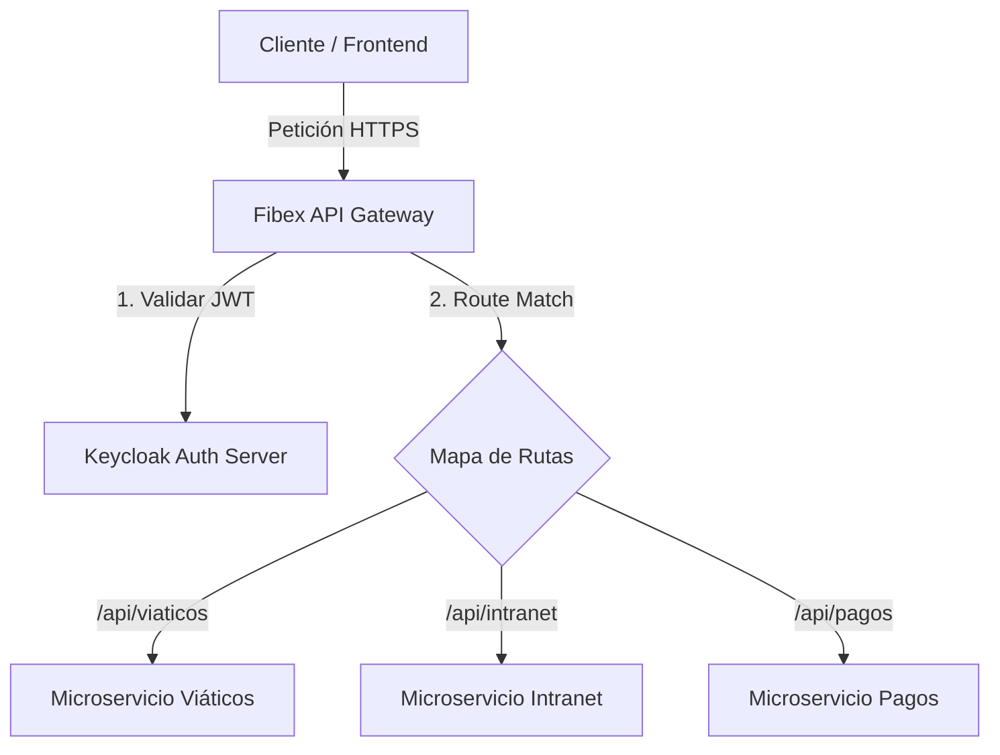
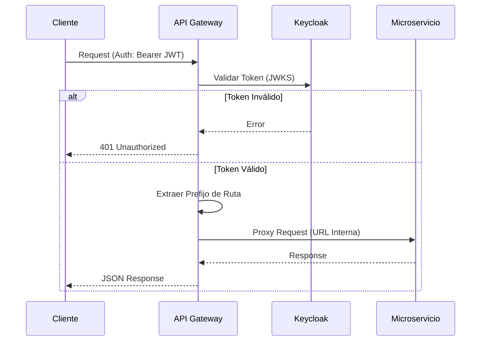

# 🚀 Fibex API Gateway v2.0 (SOLID)

Este es el punto de entrada único para el ecosistema de microservicios de **Fibex Telecom**. Diseñado bajo principios **SOLID** y utilizando el framework **Fiber** (Go), este gateway actúa como un orquestador de seguridad, enrutamiento y unificación de servicios.

## 🎯 Propósito
El Gateway tiene tres misiones críticas:
1.  **Unificación de Rutas:** Centralizar todos los microservicios bajo un único dominio/puerto, eliminando la necesidad de comunicación directa entre clientes y backends.
2.  **Seguridad Centralizada:** Validación de identidad mediante **Keycloak** antes de que cualquier petición llegue a los servicios internos.
3.  **Abstracción de Infraestructura:** Permitir que los microservicios se comuniquen entre sí de forma opaca y segura a través del gateway.

## ✨ Características Principales

### 🗺️ Enrutamiento Dinámico por Proyecto
Olvídate de configurar rutas estáticas en el código. El Gateway mapea automáticamente los prefijos de URL a microservicios mediante variables de entorno.
*   `GET /api/viaticos/*` → Redirige a la URL configurada para Viáticos.
*   `GET /api/intranet/*` → Redirige a la URL configurada para Intranet.

### 🔐 Integración Nativa con Keycloak
*   **Validación de JWT:** Cada petición entrante debe llevar un Bearer Token válido.
*   **JWKS Automático:** El gateway descarga las llaves públicas de Keycloak para validar tokens sin latencia adicional.
*   **Service-to-Service Auth:** Soporta el flujo de `Client Credentials` para que los backends se autoricen entre sí a través del gateway.

### ⚡ Performance Extrema
Construido sobre **Fiber**, el framework web más rápido para Go, garantizando una latencia mínima en el proceso de proxy.

---

## 🛠️ Configuración (.env)

El Gateway se configura totalmente mediante variables de entorno. Las rutas se definen usando el prefijo `PROXY_`.

```env
PORT=3000
KEYCLOAK_URL=https://tu-keycloak.com
KEYCLOAK_REALM=fibex

# Rutas Dinámicas: PROXY_{NOMBRE_DEL_SERVICIO}={URL_DESTINO}
PROXY_VIATICOS=http://viaticos-service:8080
PROXY_INTRANET=http://intranet-service:9000
```

---

## 🏗️ Arquitectura de Red



---

## 🚦 Flujo de Operación



1.  **Request:** El cliente envía una petición a `gateway.fibex.com/api/viaticos/data`.
2.  **Auth:** El middleware valida el token contra Keycloak.
3.  **Resolve:** El gateway identifica el prefijo `viaticos`.
4.  **Proxy:** La petición es reenviada a la URL interna de viaticos, preservando headers y parámetros.
5.  **Response:** El gateway devuelve la respuesta del microservicio al cliente de forma transparente.

---

## 🏗️ Estructura del Proyecto
*   `main.go`: Punto de entrada y configuración del servidor Fiber.
*   `pkg/auth/`: Lógica de autenticación e integración con Keycloak.
*   `pkg/proxy/`: Motor de enrutamiento dinámico y proxy inverso.
*   `pkg/config/`: Gestión de variables de entorno y estado global.

---

## 🚀 Ejecución
Para iniciar el gateway en modo desarrollo:

```bash
go run main.go
```

Para compilar el binario:

```bash
go build -o gateway main.go
./gateway
```

---
**Fibex Telecom - Departamento de Desarrollo**
*Impulsando la conectividad con arquitectura de clase mundial.*
